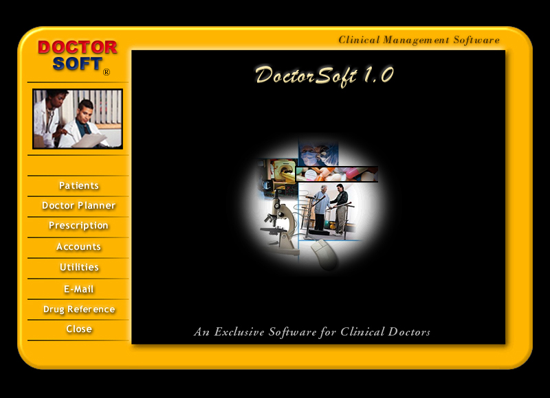

# DoctorSoft 1.0

DoctorSoft 1.0 was originally written in Visual Basic 6.0 in 200-2001. This project converts that from VB 6.0 to .NET 8.0 C# using github copilot. Most of the screens and functions are migrated.



At that time it was simple forms with access db backing up completely running locally on windows 98 or xp.

## Solution
- `DoctorSoft.sln`

## Projects
- `DoctorSoft.App` (WinForms UI shell)
- `DoctorSoft.Domain` (entities, business rules)
- `DoctorSoft.Data` (data access/repositories)
- `DoctorSoft.Reports` (report datasets + renderer abstractions)
- `DoctorSoft.Tests` (unit/integration tests)

## Current build target
- `net6.0` (selected because current machine SDK supports .NET 6 templates)

## Planned target
- Retarget to `net8.0` after SDK/tooling upgrade

## Reporting decision
- Chosen: **RDLC + Report Viewer**
- Note: `ReportViewerCore.NETCore` latest package currently supports `net8+` and is not installable on `net6.0`.
- Action: retarget solution to `net8.0`, then add report viewer package in `DoctorSoft.Reports`.

## Build command
```powershell
dotnet build DoctorSoft.sln
```

## Release publish command
```powershell
pwsh ./scripts/publish-release.ps1 -Configuration Release -Runtime win-x64
```

Published output goes to `release/publish`.

## Release validation command
```powershell
powershell -ExecutionPolicy Bypass -File ./scripts/validate-release-artifact.ps1 -PublishDir ./release/publish
```

## Coverage command
```powershell
powershell -ExecutionPolicy Bypass -File ./scripts/calculate-coverage.ps1 -MinimumLineRate 0.80
```

This runs tests with XPlat coverage, prints overall/per-package coverage, and fails if line coverage is below the threshold.

## Parity and cutover artifacts
- Report parity pack: `release/REPORT_PARITY_VERIFICATION_PACK.md`
- Cutover runbook: `release/CUTOVER_AND_HYPERCARE_RUNBOOK.md`
- Parity results template: `release/templates/report-parity-results.csv`

## Utility settings
`DoctorSoft.App/appsettings.json` supports:
- `App.LogDirectory`
- `App.BackupDirectory`
- `App.MaintenanceHistoryFileScanLimit`
- `App.MaintenanceHistoryDefaultMaxRows`

## Next implementation steps
1. Implement `AppSettings`, logging, and DB connection abstraction.
2. Build login module parity from VB6 (`frmLogin.frm`) in `DoctorSoft.App`.
3. Start first domain migration wave (`patnew.frm`, `patsear.frm`).
